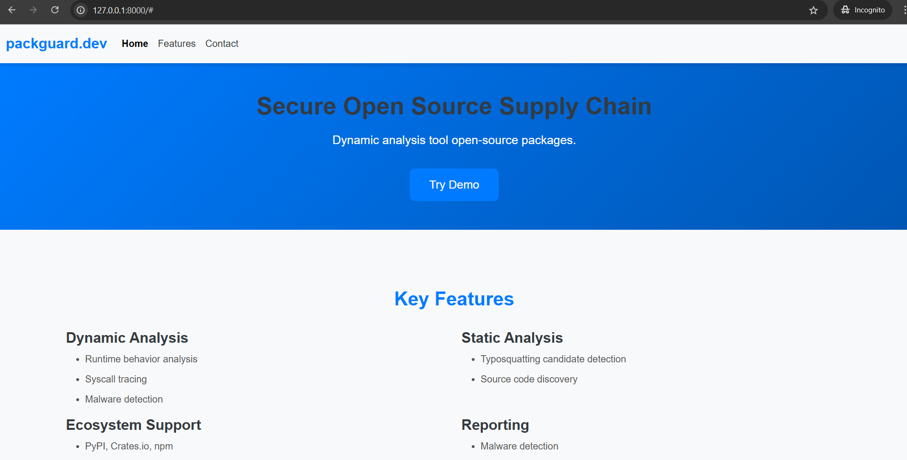
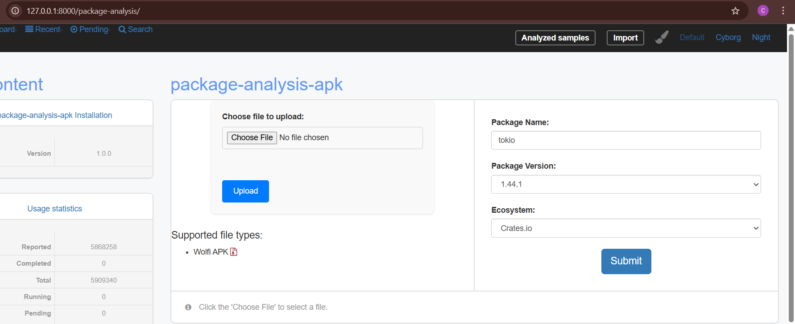
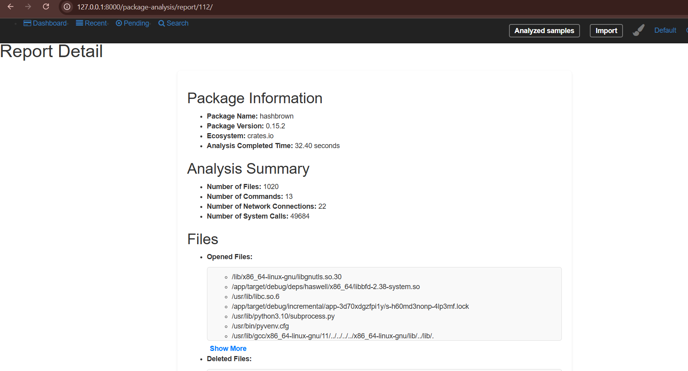

# Web Interface for Package Analysis

## Installation

### Requirements
- Docker
- Django
- requests
- WSL (Windows Subsystem for Linux) on Windows or Linux


## Demo

The homepage shows featutes of projects and contact informations.



On the right side of the dashboard, the user can enter the package name and package version of a package available on crates.io. After submitting this information, the package-analysis tool will analyze the package and display the reports once the analysis is complete.


# Reports


The report includes detailed information such as files, commands executed, domains accessed, and IP addresses involved. This data helps users understand the behavior and potential risks associated with the analyzed package.

# Run on azure
```bash
 cd rust-mal/web/package-analysis-web
#  Create virtual environment
python -m venv .env
# Active virtual environment
source .env/bin/activate
# Install libraries
pip install -r requirements.txt
```
Create database

```bash
python manage.py makemigrations
python manage.py migrates
```

Using unicorn to run
```bash
gunicorn --bind 0.0.0.0:8000 package_analysis_apk_web.wsgi:application
```
```bash
gunicorn --bind 0.0.0.0:8000 --timeout 300 --log-level debug package_analysis_apk_web.wsgi:application
```

```bash
gunicorn --bind 0.0.0.0:8000 \
         --timeout 300 \
         --log-level debug \
         --workers 4 \
         --threads 2 \
         package_analysis_apk_web.wsgi:application

```

Run on web server on port 80

```bash
sudo env "PATH=$PATH" python manage.py runserver 0.0.0.0:80
```
OR
```bash
sudo $(which python) manage.py runserver 0.0.0.0:80
```


# Install images from docker hub
```bash
docker pull pakaremon/ossgadget:latest

docker pull pakaremon/analysis:latest

docker pull pakaremon/dynamic-analysis:latest
```

# Install bandit4mal

in virtual enviroment, from folder contain 'manage.py'
```bash
cd package_analysis/src/bandit4mal

python setup.py install

```


# Ignore file in git

```bash
git rm -r --cached .
git add .
git commit -m "Update .gitignore"
```
